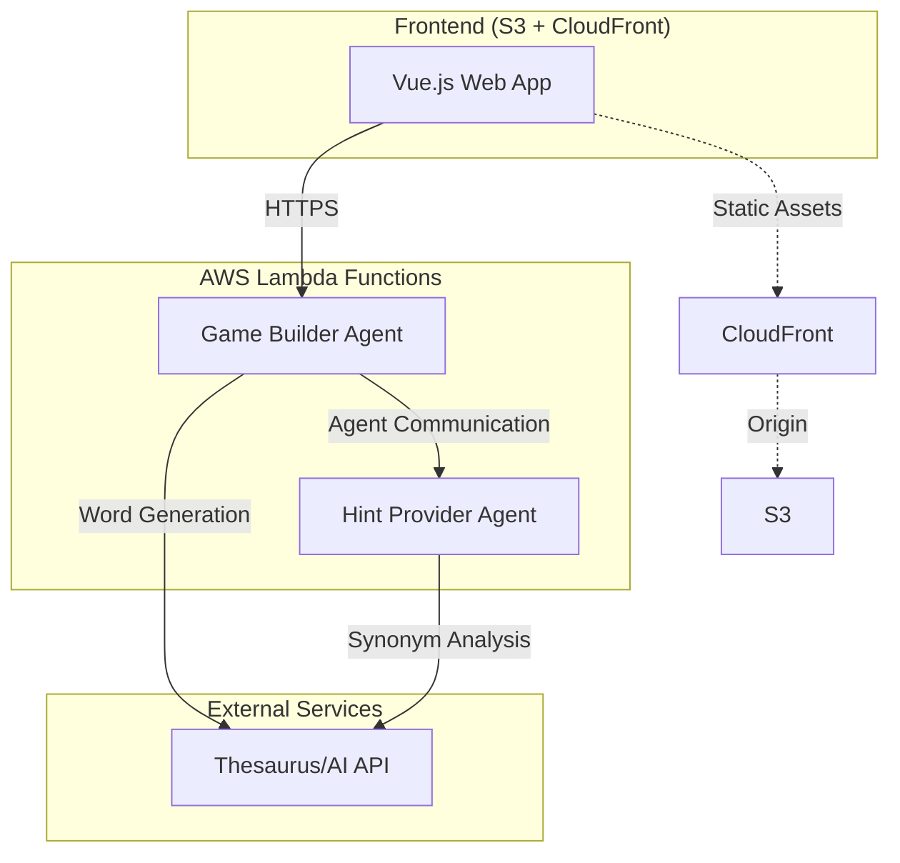
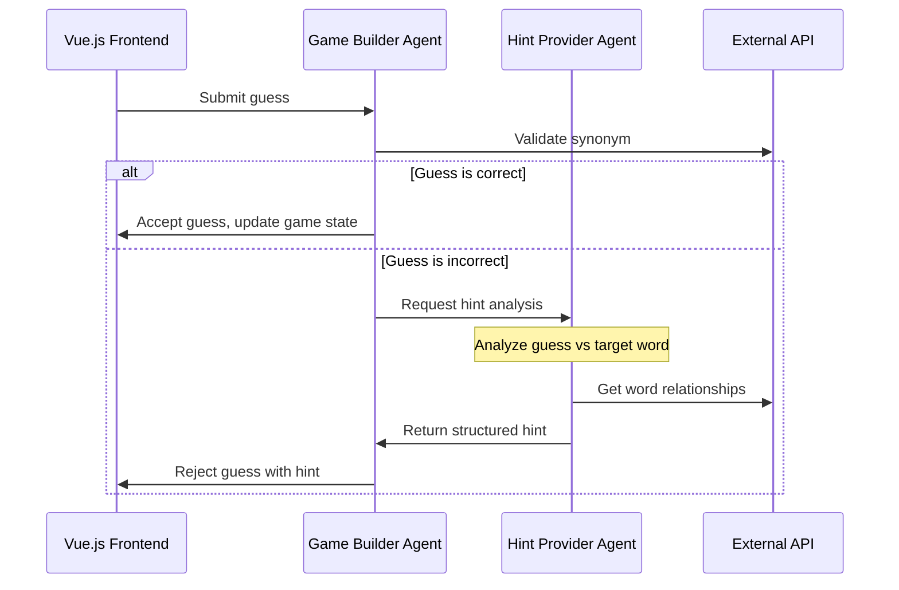

# Design Document: SynonymSeeker

## Overview

SynonymSeeker is a LinkedIn-style word puzzle game built as a learning project to explore AWS Strands multi-agent systems. The application demonstrates multi-agent coordination through two specialized agents working together: a Game Builder agent that manages game state and validates guesses, and a Hint Provider agent that analyzes incorrect guesses to provide intelligent feedback.

The system follows a cost-effective serverless architecture using Vue.js frontend deployed to S3/CloudFront, with AWS Lambda functions hosting the Strands agents. This design prioritizes educational value, demonstrating clear multi-agent patterns while maintaining security and cost efficiency.

## Architecture

### High-Level Architecture



### Multi-Agent Communication Pattern

Based on AWS Strands research, the system will use the **Agent2Agent (A2A) protocol** for inter-agent communication. This provides:

- Standardized communication between agents
- Asynchronous message passing
- Structured data exchange
- Educational value in learning A2A patterns



### Deployment Architecture

Following the established pattern from the Pokemon Drawing Game:

- **Frontend**: Vue.js SPA deployed to S3 with CloudFront CDN
- **Backend**: Lambda functions with Function URLs (no API Gateway needed)
- **Communication**: HTTPS requests from frontend to Lambda Function URLs
- **Security**: CORS configuration, input validation, secure headers

## Components and Interfaces

### Frontend Components (Vue.js)

#### GameBoard Component
- **Purpose**: Main game interface displaying target word and synonym slots
- **State Management**: Local reactive state for game session
- **Key Features**:
  - Target word display
  - Four synonym slots with letter count indicators
  - Input field for guesses
  - Give up button
  - Hint display area

#### GameService
- **Purpose**: HTTP client for backend communication
- **Methods**:
  - `startNewGame()`: Initialize new game session
  - `submitGuess(guess: string)`: Submit player guess
  - `giveUp()`: Reveal all synonyms

#### Types/Interfaces
```typescript
interface GameState {
  targetWord: string;
  synonyms: Array<{
    word: string | null;
    letterCount: number;
    found: boolean;
  }>;
  guessCount: number;
  status: 'active' | 'completed' | 'given-up';
}

interface GuessResponse {
  success: boolean;
  message: string;
  hint?: string;
  gameState: GameState;
}
```

### Backend Components (AWS Lambda + Strands)

#### Game Builder Agent
- **Deployment**: AWS Lambda with Function URL
- **Responsibilities**:
  - Game session management
  - Word generation via external APIs
  - Guess validation
  - Coordinating with Hint Provider agent
  - Response formatting

**Key Tools**:
```python
@tool
def generate_word_puzzle() -> dict:
    """Generate a target word with 4 synonyms using external API"""
    
@tool  
def validate_guess(guess: str, target_word: str, synonyms: list) -> bool:
    """Validate if guess is a correct synonym (including close matches)"""

@tool
def request_hint_analysis(guess: str, target_word: str) -> str:
    """Send guess to Hint Provider agent for analysis"""
```

#### Hint Provider Agent  
- **Deployment**: AWS Lambda with Function URL
- **Responsibilities**:
  - Analyzing incorrect guesses
  - Providing contextual feedback
  - Handling misspelling detection
  - Generating educational hints

**Key Tools**:
```python
@tool
def analyze_guess_relationship(guess: str, target_word: str) -> dict:
    """Analyze semantic relationship between guess and target"""
    
@tool
def detect_misspelling(guess: str, target_word: str, synonyms: list) -> dict:
    """Check if guess is a misspelled version of a valid synonym"""
    
@tool
def generate_hint(analysis: dict) -> str:
    """Generate helpful hint based on analysis"""
```

### Agent Communication Interface

Using AWS Strands A2A protocol for agent-to-agent communication:

```python
# Game Builder Agent calling Hint Provider
from strands.multiagent.a2a import A2AServer
from a2a.client import A2ACardResolver, ClientConfig, ClientFactory

class GameBuilderAgent:
    def __init__(self):
        self.hint_provider_url = os.environ['HINT_PROVIDER_URL']
        
    async def request_hint(self, guess: str, target_word: str) -> str:
        """Request hint analysis from Hint Provider agent"""
        async with httpx.AsyncClient() as client:
            resolver = A2ACardResolver(
                httpx_client=client, 
                base_url=self.hint_provider_url
            )
            agent_card = await resolver.get_agent_card()
            
            config = ClientConfig(httpx_client=client, streaming=False)
            factory = ClientFactory(config)
            a2a_client = factory.create(agent_card)
            
            message = create_message(
                text=f"Analyze guess '{guess}' for target word '{target_word}'"
            )
            
            async for event in a2a_client.send_message(message):
                if isinstance(event, Message):
                    return extract_text_from_message(event)
```

## Data Models

### Game Session Model
```python
from dataclasses import dataclass
from typing import List, Optional
from enum import Enum

class GameStatus(Enum):
    ACTIVE = "active"
    COMPLETED = "completed" 
    GIVEN_UP = "given-up"

@dataclass
class SynonymSlot:
    word: Optional[str]
    letter_count: int
    found: bool = False

@dataclass
class GameSession:
    session_id: str
    target_word: str
    synonyms: List[SynonymSlot]
    guess_count: int
    status: GameStatus
    guessed_words: List[str]
    
    def is_complete(self) -> bool:
        return all(slot.found for slot in self.synonyms)
```

### API Request/Response Models
```python
@dataclass
class StartGameRequest:
    pass  # No parameters needed

@dataclass
class StartGameResponse:
    session_id: str
    target_word: str
    synonym_slots: List[dict]  # letter counts only
    
@dataclass
class GuessRequest:
    session_id: str
    guess: str
    
@dataclass
class GuessResponse:
    success: bool
    message: str
    hint: Optional[str]
    game_state: dict
```

### Agent Communication Models
```python
@dataclass
class HintRequest:
    guess: str
    target_word: str
    previous_guesses: List[str]
    
@dataclass
class HintResponse:
    hint_text: str
    analysis_type: str  # "misspelling", "related", "unrelated"
    confidence: float
```

## Correctness Properties

*A property is a characteristic or behavior that should hold true across all valid executions of a system—essentially, a formal statement about what the system should do. Properties serve as the bridge between human-readable specifications and machine-verifiable correctness guarantees.*

Based on the prework analysis, here are the key correctness properties for SynonymSeeker:

### Game Session Properties

**Property 1: Game Initialization Completeness**
*For any* new game request, the Game Builder SHALL return a complete game session with exactly one target word, exactly four synonym slots with letter counts, and active status.
**Validates: Requirements 1.1, 1.2, 1.3, 1.4**

**Property 2: Synonym Validation Consistency**  
*For any* guess and target word pair, the validation result SHALL be consistent across multiple calls and SHALL accept correct synonyms and close misspellings while rejecting unrelated words.
**Validates: Requirements 2.1, 2.2**

**Property 3: Game State Preservation**
*For any* incorrect guess, the game state SHALL remain unchanged except for incrementing the guess count and adding the guess to the history.
**Validates: Requirements 2.3**

**Property 4: Duplicate Detection**
*For any* guess that has been previously submitted in the same session, the system SHALL detect it as a duplicate and provide appropriate feedback without changing game state.
**Validates: Requirements 2.4**

**Property 5: Input Validation**
*For any* input containing multiple words, special characters, or exceeding reasonable length, the system SHALL reject the input and prompt for valid single-word input.
**Validates: Requirements 2.5, 9.2, 9.3**

### Multi-Agent Communication Properties

**Property 6: Agent Communication Round-Trip**
*For any* incorrect guess, the Game Builder SHALL successfully send the guess to the Hint Provider and receive structured feedback within a reasonable timeout.
**Validates: Requirements 3.1, 3.6, 5.1, 5.3**

**Property 7: Hint Generation Quality**
*For any* incorrect guess analysis, the Hint Provider SHALL generate contextual feedback that explains why the guess was incorrect and suggests alternative approaches.
**Validates: Requirements 3.3, 3.4**

**Property 8: Misspelling Detection**
*For any* guess that is a close misspelling of a valid synonym, the Hint Provider SHALL identify the intended word and provide appropriate feedback.
**Validates: Requirements 3.5**

### Game Completion Properties

**Property 9: Completion Detection**
*For any* game session where all four synonyms have been found, the Game Builder SHALL mark the game as completed and provide a success response with all found synonyms.
**Validates: Requirements 4.1, 4.2**

**Property 10: Give Up Functionality**
*For any* active game session, when give up is requested, the Game Builder SHALL reveal all remaining synonyms and mark the game as given up.
**Validates: Requirements 4.4**

**Property 11: Guess Counting Accuracy**
*For any* game session, the guess count SHALL accurately reflect the total number of guesses submitted, regardless of correctness.
**Validates: Requirements 4.5**

### Security and Validation Properties

**Property 12: Input Sanitization**
*For any* user input, the system SHALL sanitize and validate the input before processing, rejecting potentially malicious content while preserving legitimate game guesses.
**Validates: Requirements 8.1, 8.5**

**Property 13: Prompt Injection Prevention**
*For any* input sent to external AI services, the system SHALL sanitize the input to prevent prompt injection attacks while maintaining the semantic meaning needed for synonym analysis.
**Validates: Requirements 8.2**

**Property 14: Error Information Security**
*For any* error condition, the system SHALL return user-friendly error messages that do not expose internal system details or sensitive information.
**Validates: Requirements 8.6**

### External Service Integration Properties

**Property 15: Word Generation Quality**
*For any* generated word puzzle, the target word SHALL have exactly four distinct, valid synonyms that are appropriate for the game context.
**Validates: Requirements 6.2, 6.5**

**Property 16: Service Failure Resilience**
*For any* external service failure, the system SHALL handle the failure gracefully by providing appropriate error messages and maintaining system stability.
**Validates: Requirements 6.4, 9.4**

### Session Management Properties

**Property 17: Concurrent Session Independence**
*For any* two concurrent game sessions, actions in one session SHALL not affect the state or behavior of the other session.
**Validates: Requirements 9.6**

**Property 18: Session State Handling**
*For any* session that becomes invalid (due to timeout or browser refresh), the system SHALL handle requests gracefully without exposing errors or corrupting other sessions.
**Validates: Requirements 9.7**

## Error Handling

### Frontend Error Handling
- **Network Failures**: Graceful degradation when Lambda functions are unavailable
- **Invalid Responses**: Handle malformed or unexpected API responses
- **User Input Errors**: Clear validation messages for invalid inputs
- **Session Expiry**: Automatic new game initialization when sessions become invalid

### Backend Error Handling
- **External API Failures**: Fallback behavior when thesaurus/AI services are unavailable
- **Agent Communication Failures**: Graceful degradation when Hint Provider is unreachable
- **Input Validation Errors**: Secure error responses that don't expose internal details
- **Resource Limits**: Proper handling of Lambda timeout and memory constraints

### Multi-Agent Error Scenarios
```python
class AgentCommunicationError(Exception):
    """Raised when agent-to-agent communication fails"""
    pass

class ExternalServiceError(Exception):
    """Raised when external APIs are unavailable"""
    pass

# Error handling in Game Builder Agent
async def request_hint_with_fallback(self, guess: str, target_word: str) -> str:
    try:
        return await self.request_hint_from_agent(guess, target_word)
    except AgentCommunicationError:
        # Fallback to basic hint generation
        return f"'{guess}' is not a synonym of '{target_word}'. Try thinking of words with similar meanings."
    except Exception as e:
        logger.error(f"Unexpected error in hint generation: {e}")
        return "Unable to provide hint at this time. Please try another guess."
```

## Testing Strategy

### Dual Testing Approach
The system will use both unit tests and property-based tests for comprehensive coverage:

- **Unit tests**: Verify specific examples, edge cases, and error conditions
- **Property tests**: Verify universal properties across all inputs
- Both approaches are complementary and necessary for complete validation

### Unit Testing Focus Areas
Unit tests should concentrate on:
- **Specific examples**: Demonstrate correct behavior with known inputs
- **Integration points**: Verify agent communication and external API integration
- **Edge cases**: Empty inputs, malformed data, boundary conditions
- **Error conditions**: Service failures, invalid states, security violations

### Property-Based Testing Configuration
- **Minimum 100 iterations** per property test due to randomization
- **Test framework**: Use `fast-check` for TypeScript frontend, `hypothesis` for Python backend
- **Tag format**: Each property test must reference its design document property
  - Example: `// Feature: synonym-seeker, Property 1: Game Initialization Completeness`

### Testing Architecture
```typescript
// Frontend property test example
import fc from 'fast-check';

describe('Game State Properties', () => {
  it('Property 1: Game Initialization Completeness', () => {
    // Feature: synonym-seeker, Property 1: Game Initialization Completeness
    fc.assert(fc.property(
      fc.record({}), // Any new game request
      async (request) => {
        const response = await gameService.startNewGame();
        
        expect(response.targetWord).toBeDefined();
        expect(response.synonymSlots).toHaveLength(4);
        expect(response.synonymSlots.every(slot => slot.letterCount > 0)).toBe(true);
        expect(response.status).toBe('active');
      }
    ), { numRuns: 100 });
  });
});
```

```python
# Backend property test example
from hypothesis import given, strategies as st
import pytest

class TestGameBuilderProperties:
    @given(st.text(min_size=1, max_size=50))
    def test_property_2_synonym_validation_consistency(self, guess):
        """
        Feature: synonym-seeker, Property 2: Synonym Validation Consistency
        For any guess and target word pair, validation should be consistent
        """
        target_word = "happy"
        synonyms = ["joyful", "cheerful", "glad", "pleased"]
        
        # Test consistency across multiple calls
        result1 = game_builder.validate_guess(guess, target_word, synonyms)
        result2 = game_builder.validate_guess(guess, target_word, synonyms)
        
        assert result1 == result2  # Consistency requirement
        
        # Test known correct synonyms are accepted
        if guess.lower() in [s.lower() for s in synonyms]:
            assert result1 == True
```

### Integration Testing
- **Agent Communication**: Test A2A protocol message exchange
- **External API Integration**: Test with mock thesaurus/AI services
- **End-to-End Flows**: Complete game sessions from start to finish
- **Security Testing**: Validate input sanitization and error handling

### Performance Testing Considerations
- **Lambda Cold Starts**: Measure and optimize agent initialization time
- **Agent Communication Latency**: Monitor A2A message round-trip times
- **External API Response Times**: Set appropriate timeouts and fallbacks
- **Concurrent Session Handling**: Verify system stability under load

The testing strategy emphasizes property-based testing for comprehensive coverage while using unit tests for specific scenarios and integration points. This approach ensures both correctness and educational value in demonstrating proper testing methodologies for multi-agent systems.

<function_calls>
<invoke name="prework">
<parameter name="featureName">synonym-seeker