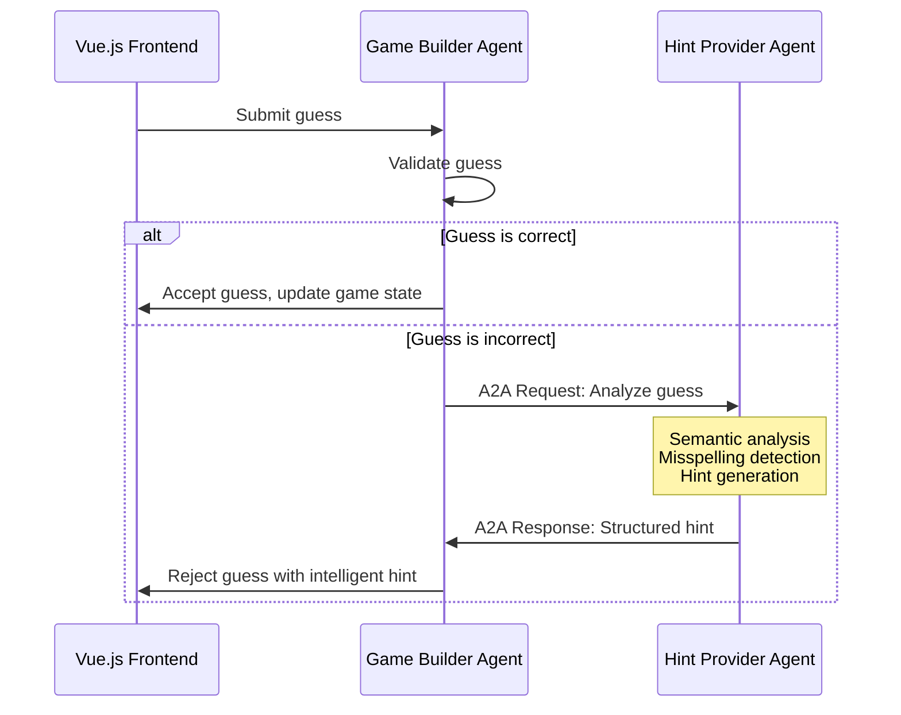

# SynonymSeeker - Multi-Agent Word Puzzle Game

A LinkedIn-style word puzzle game built as a learning project to explore AWS Strands multi-agent systems. Players guess four synonyms for a target word, with two AI agents working together to manage the game and provide intelligent feedback.

## 🔒 Security Note

**Before deploying:**
- Replace `YOUR_PROFILE` with your actual AWS CLI profile name in all scripts
- Never commit real Lambda URLs, API keys, or AWS account IDs to version control
- The `.env` file is gitignored - create it locally with your actual Lambda URL
- Review all configuration files before deployment

## 🎯 Live Demo

**Game URL**: *[Deployed Lambda Function URL - see deployment guide]*

## 🏗️ Multi-Agent Architecture

SynonymSeeker demonstrates advanced multi-agent coordination using the **Agent-to-Agent (A2A) protocol** from AWS Strands. The system showcases clear separation of responsibilities and intelligent communication patterns.

### Agent Responsibilities

#### 🎮 Game Builder Agent
- **Primary Role**: Game state management and guess validation
- **Key Functions**:
  - Generate word puzzles with target words and synonyms
  - Validate player guesses (including misspelling detection)
  - Manage session state and game progression
  - Coordinate with Hint Provider for intelligent feedback
- **Deployment**: AWS Lambda with Function URL
- **Communication**: Initiates A2A requests to Hint Provider

#### 💡 Hint Provider Agent  
- **Primary Role**: Analyze incorrect guesses and provide contextual feedback
- **Key Functions**:
  - Semantic analysis of guess-to-target relationships
  - Advanced misspelling detection using edit distance algorithms
  - Generate educational, encouraging hints
  - Categorize relationships (related, unrelated, wrong form, etc.)
- **Deployment**: AWS Lambda with A2A Server
- **Communication**: Responds to A2A requests from Game Builder

### A2A Communication Flow



### Fallback Architecture

The system implements graceful degradation:
1. **Primary**: A2A communication between agents
2. **Fallback 1**: Direct HTTP communication
3. **Fallback 2**: Basic hint generation within Game Builder

This ensures the game remains playable even if agent communication fails.

## 🛠️ Technology Stack

### Frontend
- **Vue.js 3** with Composition API
- **TypeScript** for type safety
- **Vite** for build tooling and development
- **Vitest** for unit testing

### Backend
- **Python 3.13** with AWS Strands SDK
- **AWS Lambda** for serverless compute
- **A2A Protocol** for agent communication
- **Hypothesis** for property-based testing

### Infrastructure
- **AWS SAM** for Infrastructure as Code
- **S3 + CloudFront** for frontend hosting
- **Lambda Function URLs** for direct HTTPS access
- **AWS Secrets Manager** for secure configuration

## 🚀 Quick Start

### Prerequisites

- **AWS CLI** configured with your AWS profile
- **Python 3.13+** 
- **Node.js 22+**
- **AWS SAM CLI**

Verify AWS session:
```bash
aws sts get-caller-identity --profile YOUR_PROFILE
```

### 1. Clone and Setup

```bash
git clone https://github.com/WayneGreeley/strands-synonym-game.git
cd strands-synonym-game
```

### 2. Backend Setup

```bash
# Activate virtual environment
source backend/venv/bin/activate

# Install dependencies (already included in venv)
pip install -r backend/requirements.txt

# Run tests
python -m pytest backend/tests/ -v
```

### 3. Frontend Setup

```bash
cd frontend

# Install dependencies
npm install

# Run tests
npm test

# Start development server
npm run dev
```

### 4. Deploy to AWS

#### Deploy Secrets (First Time Only)
```bash
cd infrastructure

# Deploy secrets template
sam deploy --template-file secrets-template.yaml --stack-name synonym-seeker-secrets --capabilities CAPABILITY_IAM --no-confirm-changeset --profile YOUR_PROFILE

# Configure secrets (optional - system works without external APIs)
./setup-secrets.sh
```

#### Deploy Main Application
```bash
# Deploy Lambda functions
sam deploy --no-confirm-changeset --profile YOUR_PROFILE

# Deploy frontend infrastructure
sam deploy --template-file frontend-template.yaml --stack-name synonym-seeker-frontend --capabilities CAPABILITY_IAM --no-confirm-changeset --profile YOUR_PROFILE

# Build and deploy frontend
npm run build
aws s3 sync dist/ s3://synonym-seeker-frontend-bucket --profile YOUR_PROFILE
```

## 🧪 Testing Strategy

The project implements comprehensive testing with both unit tests and property-based tests:

### Backend Testing (101 tests)
- **Unit Tests**: Specific examples and edge cases
- **Property-Based Tests**: Universal correctness properties across random inputs
- **Integration Tests**: Complete game flows and agent communication
- **Security Tests**: Input validation and sanitization

```bash
# Run all backend tests
source backend/venv/bin/activate
python -m pytest backend/tests/ -v

# Run specific test categories
python -m pytest backend/tests/test_integration.py -v
python -m pytest backend/tests/test_security_properties.py -v
```

### Frontend Testing (51 tests)
- **Component Tests**: Vue.js component behavior
- **Service Tests**: HTTP client and error handling
- **Type Tests**: TypeScript interface validation

```bash
cd frontend
npm test
```

### Key Testing Features
- **Property-Based Testing**: Validates correctness across thousands of random inputs
- **Concurrent Testing**: Verifies session independence and thread safety
- **A2A Communication Testing**: Mocks and validates agent-to-agent protocols
- **Security Testing**: Comprehensive input sanitization and injection prevention

## 🔒 Security Features

### Input Validation & Sanitization
- Multi-layer validation (client and server)
- Prompt injection prevention
- Unicode support with security constraints
- Length limits and character filtering

### AWS Security Best Practices
- **Least Privilege IAM**: Minimal required permissions
- **Secrets Management**: AWS Secrets Manager integration
- **HTTPS Only**: All communications encrypted
- **CORS Configuration**: Proper cross-origin policies

### Error Handling
- No internal details exposed to users
- Comprehensive logging for debugging
- Graceful degradation on failures

## 📊 Educational Value

### Multi-Agent Patterns Demonstrated

1. **Clear Separation of Concerns**
   - Game Builder: State management and validation
   - Hint Provider: Analysis and feedback generation

2. **A2A Protocol Implementation**
   - Structured message passing
   - Asynchronous communication
   - Error handling and fallbacks

3. **Scalable Architecture**
   - Stateless agents for horizontal scaling
   - Independent deployment and updates
   - Concurrent session handling

### Strands SDK Concepts

- **Agent Definition**: System prompts and tool configuration
- **Tool Implementation**: Decorated functions with type hints
- **A2A Server Setup**: Multi-agent communication endpoints
- **Error Handling**: Graceful degradation patterns

## 🏛️ Architecture Decisions

### Why A2A Protocol?
- **Educational Value**: Learn modern multi-agent communication
- **Scalability**: Agents can be deployed and scaled independently
- **Maintainability**: Clear boundaries and responsibilities
- **Extensibility**: Easy to add new agents or capabilities

### Why Lambda Function URLs?
- **Simplicity**: Direct HTTPS access without API Gateway
- **Cost**: No additional API Gateway charges
- **Performance**: Reduced latency from fewer hops
- **Security**: Built-in CORS and authentication support

### Why Vue.js + TypeScript?
- **Type Safety**: Catch errors at compile time
- **Modern Framework**: Composition API and reactive state
- **Developer Experience**: Excellent tooling and debugging
- **Performance**: Efficient virtual DOM and tree shaking

## 🔧 Development Workflow

### Local Development

1. **Backend Development**:
   ```bash
   source backend/venv/bin/activate
   python -m pytest backend/tests/ --watch
   ```

2. **Frontend Development**:
   ```bash
   cd frontend
   npm run dev
   ```

3. **Testing Changes**:
   ```bash
   # Backend tests
   python -m pytest backend/tests/ -v
   
   # Frontend tests  
   npm test
   ```

### Deployment Workflow

1. **Test Locally**: Ensure all tests pass
2. **Deploy Backend**: SAM deploy for Lambda functions
3. **Deploy Frontend**: Build and sync to S3
4. **Verify**: Test the live application

## 📈 Performance Characteristics

### Scalability
- **Concurrent Sessions**: Tested with 10+ simultaneous games
- **Agent Communication**: Sub-second A2A response times
- **Frontend Performance**: Optimized bundle size and caching

### Cost Optimization
- **Free Tier Friendly**: Designed to stay within AWS free tier
- **Efficient Caching**: CloudFront reduces Lambda invocations
- **Right-Sized Resources**: 512MB Lambda memory, 30s timeout

## 🐛 Troubleshooting

### Common Issues

1. **AWS Session Expired**:
   ```bash
   aws login --profile YOUR_PROFILE
   ```

2. **Lambda Function Not Found**:
   ```bash
   sam deploy --no-confirm-changeset --profile YOUR_PROFILE
   ```

3. **Frontend Not Loading**:
   ```bash
   cd frontend
   npm run build
   aws s3 sync dist/ s3://synonym-seeker-frontend-bucket --profile YOUR_PROFILE
   ```

4. **Tests Failing**:
   ```bash
   # Backend
   source backend/venv/bin/activate
   python -m pytest backend/tests/ -v --tb=short
   
   # Frontend
   cd frontend
   npm test
   ```

### Debug Mode

Enable detailed logging by setting environment variables:
```bash
export DEBUG=true
export LOG_LEVEL=debug
```

## 🤝 Contributing

1. **Fork the repository**
2. **Create a feature branch**: `git checkout -b feature/amazing-feature`
3. **Run tests**: Ensure all tests pass
4. **Commit changes**: `git commit -m "Add amazing feature"`
5. **Push to branch**: `git push origin feature/amazing-feature`
6. **Open a Pull Request**

### Development Guidelines

- **Test-Driven Development**: Write tests before implementation
- **Type Safety**: Use TypeScript for frontend, type hints for Python
- **Security First**: Validate all inputs, sanitize outputs
- **Documentation**: Update README and code comments

## 📝 License

This project is licensed under the MIT License - see the [LICENSE](LICENSE) file for details.

## 🙏 Acknowledgments

- **AWS Strands Team**: For the excellent multi-agent SDK
- **Vue.js Community**: For the fantastic frontend framework
- **Hypothesis Team**: For property-based testing tools
- **AWS SAM Team**: For Infrastructure as Code tooling

---

**Built with ❤️ as a learning project to explore multi-agent systems and AWS Strands patterns.**